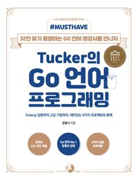

# programming-of-tuckers-go-language

- 예제코드: https://github.com/tuckersGo/musthaveGo
- [Tucker의 Go 언어 프로그래밍 공부자료](https://github.com/kyh1126/TIL/tree/main/lecture/Tucker%EC%9D%98_Go_%EC%96%B8%EC%96%B4_%ED%94%84%EB%A1%9C%EA%B7%B8%EB%9E%98%EB%B0%8D)
